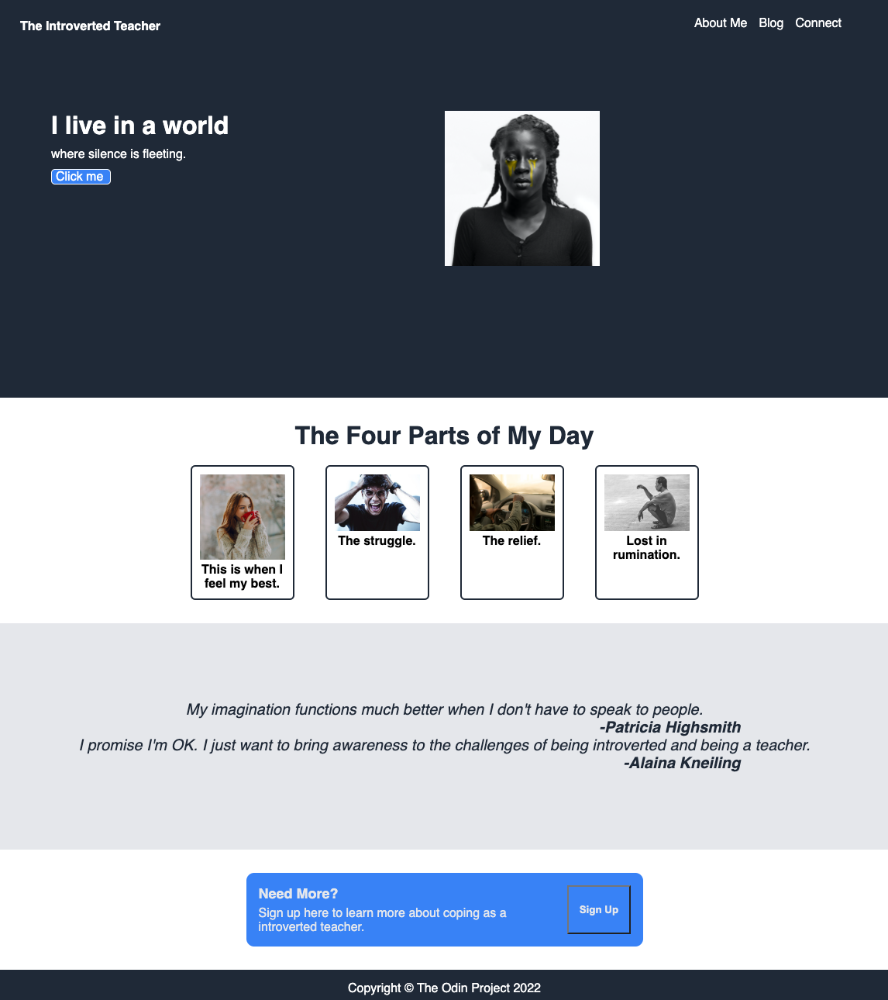

# The Introverted Teacher

## I spent 10 years teaching high school math as an introvert. I'd like to bring awareness to the challenges that can bring. Teaching is a very "out" career. I believe introverted teachers bring strengths to the classroom and also generally struggle more than extroverted teachers. We pay a price to talk all day non stop. This site shows off my CSS skills (and by shows off I mean this was one of the first things I ever made so it shows ~growth potential~).

